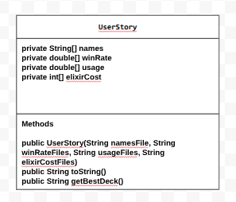

# Unit 2 - Data for Social Good Project

## Introduction

Software engineers develop programs to work with data and provide information to a user. Each user has different needs based on the information they are looking for from data. Your goal is to create a data analysis program for your user that stores and analyzes data to provide the information they need.

## Requirements

Use your knowledge of object-oriented programming, one-dimensional (1D) arrays, and algorithms to create your data analysis program:
- **Write a class** – Write a class to represent your user or business and store and analyze their data with no-argument and parameterized constructors.
- **Create at least two 1D arrays** – Create at least two 1D arrays to store the data that your user needs information about.
- **Write a method** – Write a method that finds or manipulates the elements in a 1D array to provide the information your user needs.
- **Implement a toString() method** – Write a toString() method that returns general information about the data (for example, number of values in the dataset).
- **Document your code** – Use comments to explain the purpose of the methods and code segments and note any preconditions and postconditions.

## User Story 

Include your User Story you analyzed for your project here. Your User Story should have the following format: 

As a new player who is tired of constantly losing games, I want to be able to learn which cards I can use to build the best possible deck, so that I can win more games and reach 10,000 trophies

## Dataset 

https://www.kaggle.com/datasets/hrish4/clash-royale-cards-data

**Name**(String) Provides Name of the Card

**elixirCost**(double) shows the cost to play the card during a game

**winRate** (double) shows the win percentage of each card

**usage** (double) shows how much a card is used by the players

## UML Diagram 

 

## Description 

This project is a program that helps users find the best deck of 8 cards. It uses arrays to store each card’s name, win rate, usage, and elixir cost, and a parameterized constructor in the UserStory class loads this data from text files. The toString() method displays all the cards and their details, while the getBestDeck() method selects the top 8 cards with the highest win rates. This project demonstrates using arrays, methods, loops, and file input to analyze a dataset and help the user create the best deck they can.
